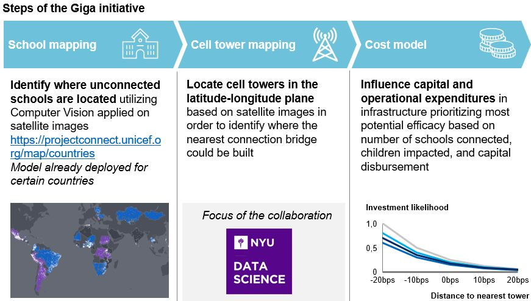
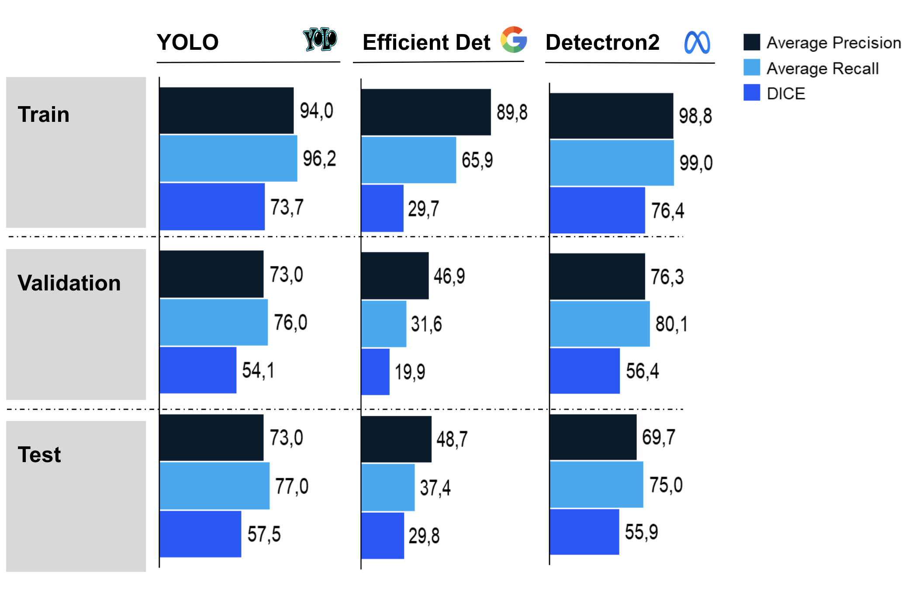

# UNICEF Tower Mapping - NYU Capstone project

<!-- PROJECT LOGO -->
<br />
<div align="center">
  
  <h3 align="center"> UNICEF Tower Mapping - Giga initiative </h3>

  <p align="center">
    Code and solution repository containing the functionalities for the communication cell tower mapping effort developed jointly between UNICEF and NYU as part of the Giga initiative
    <br />
    <a href="https://www.unicef.org/innovation/giga"><strong>Visit GIGA's site »</strong></a>
  </p>
</div>


<!-- TABLE OF CONTENTS -->
## Table of contents
  <ol>
    <li> <a href="#context-of-the-giga-initiative">Context of the Giga initiative</a> </li>
    <li><a href="#data-overview">Data overview</a></li>
    <li><a href="#solution-approach">Solution approach</a></li>
    <li><a href="#results-obtained">Results obtained</a></li>
    <li><a href="#prediction-functionalities">Prediction functionalities</a></li>
    <li><a href="#repository-structure">Repository structure</a></li>
    <li><a href="#usage">Usage</a></li>
     <ul>
        <li><a href="#prerequisites">Prerequisites</a></li>
        <li><a href="#execution">Execution</a></li>
        <li><a href="#timing">Timing</a></li>
      </ul>
  </ol>


<!-- CONTEXT -->
## Context of the Giga initiative

<div align="justify">

With 4.9Bn internet users, the world is becoming increasingly connected. This widespread network accessibility enables, among other things, increased developmental opportunities and a democratized platform through which the equity gap can be bridged. However, there still are 1.3Bn unconnected children worldwide \cite{unicef2020}. The lack of internet connectivity prevents them from accomplishing their educational needs and exacerbates existing inequalities. 
<br>
In this context, UNICEF together with the International Telecommunications Union (ITU) launched in 2019 a specialized global plan, the Giga initiative, with the goal to connect every school to the Internet by 2030. This initiative comprises three key efforts portrayed below.



<!-- DATA OVERVIEW -->
## Data overview

<div align="justify">

The data used throughout our project has comprised two main blocks: high-resolution, $512 \times 512$ pixel satellite images and COCO JSON annotation files with bounding box coordinates for each image. 
To obtain the satellite images required for our object detection models, we went through a sequential list of pre-processing steps. 
  <ol>
    <li>Queried the open-source <a href="https://www.openstreetmap.org/#map=4/38.01/-95.84">Open Street Maps</a>  database to collect a list of latitude and longitude coordinates of cell towers in several countries. In line with the priorities of our UNICEF partners, we focused our attention on cell towers in the following countries: Algeria, Argentina, Angola, Brazil, Chad, China, India, Iran, Libya, Mali, Niger, Republic of Congo, Sudan, South Africa, and Saudi Arabia. To ensure robustness of our model in predicting cell towers in a variety of settings, we collected coordinates from both rural and urban settings. We defined "rural" images as images that contained cell towers with very few or no other structures in the image. Typically, these were images of single cell towers against plain or desert backgrounds. In contrast, "urban" images were those with other structures (such as buildings, telephone poles and streetlights) in the background.
    <li> Verified the presence of cell towers at each of the latitude and longitude coordinates through manual inspection on
    <a href="https://www.google.com/maps">Google Maps</a> . Then, we provided 3000 filtered coordinates (for train/val/test) together with 4000 unfiltered ones (to assess behavior in new images of unknown nature) to our UNICEF mentors who then shared with us satellite images for these coordinates. 
    <li> Enhanced the resolution of the raw satellite images. Initially, the satellite images provided were blurry, which would make detection of cell towers difficult. Thus, we enhanced the images with the <a href="https://github.com/TencentARC/GFPGAN">Tencent GFPGAN</a> and resized the images to $512 \times 512$ pixels.
   <li> Examined each image to visually confirm the presence of a cell tower. Then, using <a href="https://labelbox.com/">LabelBox AI</a>, we created a single bounding box around the tower, shadow, and base in each of the images used for the model. We exported these bounding box annotations as COCO JSON files to be used in conjunction with the satellite images in our pre-trained models.
  </ol>

<!-- APPROACH -->
## Solution approach

We developed a Cell Tower Object Detection engine using Satellite images following a 5-step approach. First, we manually gathered cell tower images from publicly available sources. Then, we enhanced the resolution using a pre-trained GAN and filtered the images. Next, we modelled the problem using three state-of-the-art object detection models (Efficient Det, YOLO, Detectron2). After modelling, we evaluated the goodness of fit across a grid of metrics. And finally, we retrieved bounding boxes and a latitude-longitude mapping of cell tower predictions  

<!-- RESULTS -->
## Results obtained
The figure underneath shows precision, recall, and DICE for our three models using an IoU threshold of 0.5. We added DICE as an additional metric because it is a proxy for model accuracy. YOLO is the model with highest precision, recall, and DICE on the test set. It is important to note that performance drops sharply in the validation and test set for the three models. Object detection is a very data intensive task and we were only able to train with 3,000 images due to time constraints and data labelling being a very time consuming task, leading to some degree of overfitting.
<br> 

<!-- PREDICTION FUNCTIONALITIES -->
## Prediction functionalities

XXX

<!-- REPOSITORY -->
## Repository structure

Having understood the methodological approach and live runtime, in this section we specify the contents of the solution repository. Below one can find a diagram of the directory structure. 

```
UNICEF Tower Mapping
└───README.md
└───code
└───reports
```


<!-- USAGE -->
## Usage

### Prerequisites

XXX

### Execution

XXX


</div>
